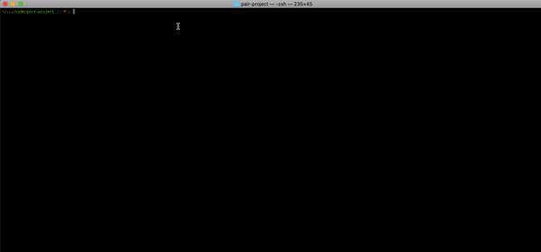

    ████████╗██╗░░██╗███████╗  ███████╗███████╗███████╗██╗░█████╗░██╗███████╗███╗░░██╗████████╗
    ╚══██╔══╝██║░░██║██╔════╝  ██╔════╝██╔════╝██╔════╝██║██╔══██╗██║██╔════╝████╗░██║╚══██╔══╝
    ░░░██║░░░███████║█████╗░░  █████╗░░█████╗░░█████╗░░██║██║░░╚═╝██║█████╗░░██╔██╗██║░░░██║░░░
    ░░░██║░░░██╔══██║██╔══╝░░  ██╔══╝░░██╔══╝░░██╔══╝░░██║██║░░██╗██║██╔══╝░░██║╚████║░░░██║░░░
    ░░░██║░░░██║░░██║███████╗  ███████╗██║░░░░░██║░░░░░██║╚█████╔╝██║███████╗██║░╚███║░░░██║░░░
    ░░░╚═╝░░░╚═╝░░╚═╝╚══════╝  ╚══════╝╚═╝░░░░░╚═╝░░░░░╚═╝░╚════╝░╚═╝╚══════╝╚═╝░░╚══╝░░░╚═╝░░░
    
    ░██╗░░░░░░░██╗░█████╗░██████╗░██╗░░██╗░█████╗░██╗░░░██╗████████╗
    ░██║░░██╗░░██║██╔══██╗██╔══██╗██║░██╔╝██╔══██╗██║░░░██║╚══██╔══╝
    ░╚██╗████╗██╔╝██║░░██║██████╔╝█████═╝░██║░░██║██║░░░██║░░░██║░░░
    ░░████╔═████║░██║░░██║██╔══██╗██╔═██╗░██║░░██║██║░░░██║░░░██║░░░
    ░░╚██╔╝░╚██╔╝░╚█████╔╝██║░░██║██║░╚██╗╚█████╔╝╚██████╔╝░░░██║░░░
    ░░░╚═╝░░░╚═╝░░░╚════╝░╚═╝░░╚═╝╚═╝░░╚═╝░╚════╝░░╚═════╝░░░░╚═╝░░░

# Cole and Thach's Mod 1 Project

> A workout app to help users workout efficiently

[](https://travis-ci.org/badges/badgerbadgerbadger)

---

## Installation

- First fork the repository using `https://github.com/Colebuildanddevelop/thach_cole_project`

### Clone

- After forking clone down the repository

### Setup

> update and install this package first

```shell
$ bundle install
```

> now run the program with

```shell
$ ruby bin/run.rb
```

---



---

## Features

- Username and password authentication.

- Users can edit/delete their account.

- A user can be suggested a trainer based off their own workout preferences.

- A user can be suggested a diet based off their workout history.

- A user can get various information regarding the gyms and trainers availible.

- Helps a user make the most efficient choices given the users workout history and preferences.

---

## Team

> Contributors

| <a href="https://github.com/Colebuildanddevelop" target="_blank">**Cole Davis**</a> | <a href="https://github.com/tedluu" target="_blank">**Thach Luu**</a>
| :---: |:---:
| [](http://fvcproductions.com) | [](http://fvcproductions.com)

---

## Support

Reach out to us at one of the following places!

- Cole's Github at <a href="https://github.com/Colebuildanddevelop" target="_blank">`github.com`</a>
- Thach's Github at <a href="https://github.com/tedluu" target="_blank">`github.com`</a>

---

## License

[](http://badges.mit-license.org)

- **[MIT license](http://opensource.org/licenses/mit-license.php)**
